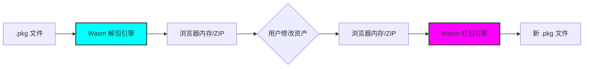

# WE PKG CYBER

一款基于 WebAssembly 的浏览器端 Wallpaper Engine 资产解包/打包工具。


## 功能特性

- **纯本地处理** - 所有数据在浏览器本地处理，无需上传至服务器
- **资产解包** - 提取 scene.pkg 中的音频、图像、配置等资源
- **资产打包** - 将修改后的资源重新打包为 scene.pkg
- **WASM 加速** - 使用 Go + WebAssembly 实现高性能二进制处理

## 工作流 (Workflow)



## 技术栈

- **前端**: Vue 3 + TypeScript + Vite
- **核心引擎**: Go 1.26 + WebAssembly
- **压缩处理**: JSZip
- **构建工具**: Make

## 快速开始

### 环境要求

- Node.js >= 20
- Go >= 1.26
- Make

### 安装依赖

```bash
make install
```

### 开发模式

```bash
make dev
```

此命令会：
1. 编译 Go WASM 模块
2. 启动 Vite 开发服务器

### 构建 WASM 模块

```bash
make build-wasm
```

### 生产构建

```bash
cd web && npm run build
```

## 使用说明

### 解包资产

1. 将 `scene.pkg` 文件拖入左侧 **EXTRACT** 区域
2. 等待解析完成，查看资产清单
3. 点击 **EXPORT ZIP** 下载提取的资源

### 打包资产

1. 修改提取的资源（替换图像、音频等）
2. 保持原目录结构，打包为 ZIP 文件
3. 将 ZIP 拖入右侧 **REPACK** 区域
4. 点击 **BUILD PKG** 生成新的 `scene.pkg`

## 项目结构

```
.
├── Makefile              # 构建脚本
├── wasm-core/            # Go WASM 核心引擎
│   └── cmd/wepkg/
│       └── main.go       # WASM 入口
└── web/                  # 前端应用
    ├── src/
    │   └── App.vue       # 主界面
    └── public/
        └── main.wasm     # 编译后的 WASM 模块
```

## 鸣谢 (Credits)

本项目受到了以下开源项目的启发与底层逻辑支持：

* [redpfire/we](https://github.com/redpfire/we) - 本项目核心解包/打包逻辑的 C++ 原始实现。感谢原作者对 `.pkg` 格式研究的贡献。
* [JSZip](https://stuk.github.io/jszip/) - 提供强大的浏览器端压缩支持。
* [Go WebAssembly](https://go.dev/wiki/) - 让高性能二进制处理走进浏览器。

## 作者

[@Vito Wong](https://github.com/fuzqing)

[@Gemini](https://gemini.google.com/app)

## 许可证

MIT
